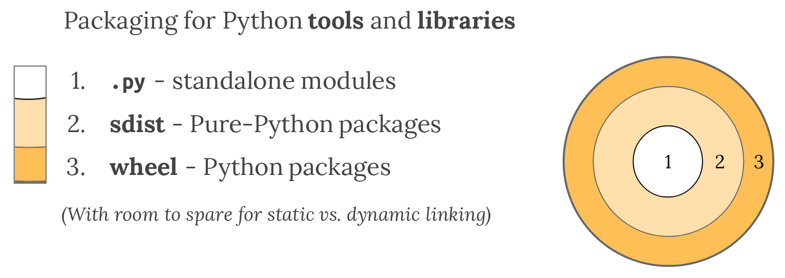
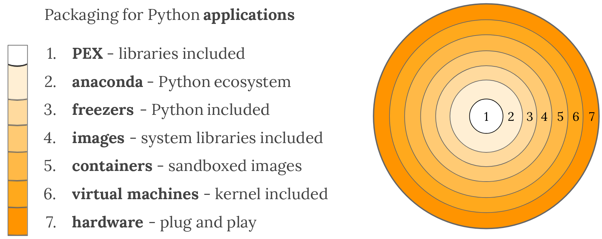

===================================
An Overview of Packaging for Python
===================================

.. Editors, see notes at the bottom of the document for maintenance info.

As a general-purpose programming language, Python is designed to be
used in many ways. You can build web sites or industrial robots or a
game for your friends to play, and much more, all using the same
core technology.

Python's flexibility is why the first step in every Python project
must be to think about the project's audience and the corresponding
environment where the project will run. It might seem strange to think
about packaging before writing code, but this process does wonders for
avoiding future headaches.

This overview provides a general-purpose decision tree for reasoning
about Python's plethora of packaging options. Read on to choose the best
technology for your next project.

.. contents:: Contents
   :local:

Thinking about deployment
-------------------------

Packages exist to be installed (or *deployed*), so before you package
anything, you'll want to have some answers to the deployment questions
below:

* Who are your software's users? Will your software be installed by
  other developers doing software development, operations people in a
  datacenter, or a less software-savvy group?
* Is your software intended to run on servers, desktops, mobile
  clients (phones, tablets, etc.), or embedded in dedicated devices?
* Is your software installed individually, or in large deployment batches?

Packaging is all about target environment and deployment
experience. There are many answers to the questions above and each
combination of circumstances has its own solutions. With this
information, the following overview will guide you to the packaging
technologies best suited to your project.

Packaging Python libraries and tools
------------------------------------

You may have heard about PyPI, ``setup.py``, and ``wheel``
files. These are just a few of the tools Python's ecosystem provides
for distributing Python code to developers, which you can read about in
:doc:`guides/distributing-packages-using-setuptools`.

The following approaches to packaging are meant for libraries and
tools used by technical audience in a development setting. If you're
looking for ways to package Python for a non-technical audience and/or
a production setting, skip ahead to :ref:`packaging-applications`.

Python modules
^^^^^^^^^^^^^^

A Python file, provided it only relies on the standard library, can be
redistributed and reused. You will also need to ensure it's written
for the right version of Python, and only relies on the standard
library.

This is great for sharing simple scripts and snippets between people
who both have compatible Python versions (such as via email,
StackOverflow, or GitHub gists). There are even some entire Python
libraries that offer this as an option, such as `bottle.py
<https://bottlepy.org/docs/dev/>`_ and :doc:`boltons
<boltons:architecture>`.

However, this pattern won't scale for projects that consist of
multiple files, need additional libraries, or need a specific version
of Python, hence the options below.

Python source distributions
^^^^^^^^^^^^^^^^^^^^^^^^^^^

If your code consists of multiple Python files, it's usually organized
into a directory structure. Any directory containing Python files can
comprise an :term:`Import Package`.

Because packages consist of multiple files, they are harder to
distribute. Most protocols support transferring only one file at a
time (when was the last time you clicked a link and it downloaded
multiple files?). It's easier to get incomplete transfers, and harder
to guarantee code integrity at the destination.

So long as your code contains nothing but pure Python code, and you
know your deployment environment supports your version of Python, then
you can use Python's native packaging tools to create a *source*
:term:`Distribution Package`, or *sdist* for short.

Python's *sdists* are compressed archives (``.tar.gz`` files)
containing one or more packages or modules. If your code is
pure-Python, and you only depend on other Python packages, you can
:doc:`go here to learn more <python:distutils/sourcedist>`.

If you rely on any non-Python code, or non-Python packages (such as
`libxml2 <https://en.wikipedia.org/wiki/Libxml2>`_ in the case of
`lxml <https://pypi.org/project/lxml/>`_, or BLAS libraries in the
case of `numpy <https://pypi.org/project/numpy>`_), you will need to
use the format detailed in the next section, which also has many
advantages for pure-Python libraries.

.. note:: Python and PyPI support multiple distributions providing
   different implementations of the same package. For instance the
   unmaintained-but-seminal `PIL distribution
   <https://pypi.org/project/PIL/>`_ provides the PIL package, and so
   does `Pillow <https://pypi.org/project/Pillow/>`_, an
   actively-maintained fork of PIL!

   This Python packaging superpower makes it possible for Pillow to be
   a drop-in replacement for PIL, just by changing your project's
   ``install_requires`` or ``requirements.txt``.

Python binary distributions
^^^^^^^^^^^^^^^^^^^^^^^^^^^

So much of Python's practical power comes from its ability to
integrate with the software ecosystem, in particular libraries written
in C, C++, Fortran, Rust, and other languages.

Not all developers have the right tools or experiences to build these
components written in these compiled languages, so Python created the
:term:`Wheel`, a package format designed to ship libraries with
compiled artifacts. In fact, Python's package installer, ``pip``,
always prefers wheels because installation is always faster, so even
pure-Python packages work better with wheels.

Binary distributions are best when they come with source distributions
to match. Even if you don't upload wheels of your code for every
operating system, by uploading the sdist, you're enabling users of
other platforms to still build it for themselves. Default to
publishing both sdist and wheel archives together, *unless* you're
creating artifacts for a very specific use case where you know the
recipient only needs one or the other.

Python and PyPI make it easy to upload both wheels and sdists
together. Just follow the :doc:`tutorials/packaging-projects`
tutorial.

   Python's recommended built-in library and tool packaging
   technologies. Excerpted from `The Packaging Gradient (2017)
   <https://www.youtube.com/watch?v=iLVNWfPWAC8>`_.

.. _packaging-applications:

Packaging Python applications
-----------------------------

So far we've only discussed Python's native distribution tools. Based
on our introduction, you would be correct to infer these built-in
approaches only target environments which have Python, and an
audience who knows how to install Python packages.

With the variety of operating systems, configurations, and people out
there, this assumption is only safe when targeting a developer
audience.

Python's native packaging is mostly built for distributing reusable
code, called libraries, between developers. You can piggyback
**tools**, or basic applications for developers, on top of Python's
library packaging, using technologies like
:doc:`setuptools entry_points <userguide/entry_point>`.

Libraries are building blocks, not complete applications. For
distributing applications, there's a whole new world of technologies
out there.

The next few sections organize these application packaging options
according to their dependencies on the target environment,
so you can choose the right one for your project.

Depending on a framework
^^^^^^^^^^^^^^^^^^^^^^^^

Some types of Python applications, like web site backends and other
network services, are common enough that they have frameworks to
enable their development and packaging. Other types of applications,
like dynamic web frontends and mobile clients, are complex enough to
target that a framework becomes more than a convenience.

In all these cases, it makes sense to work backwards, from the
framework's packaging and deployment story. Some frameworks include a
deployment system which wraps the technologies outlined in the rest of
the guide. In these cases, you'll want to defer to your framework's
packaging guide for the easiest and most reliable production experience.

If you ever wonder how these platforms and frameworks work under the
hood, you can always read the sections beyond.

Service platforms
*****************

If you're developing for a "Platform-as-a-Service" or "PaaS" like
Heroku or Google App Engine, you are going to want to follow their
respective packaging guides.

* `Heroku <https://devcenter.heroku.com/articles/getting-started-with-python>`_
* `Google App Engine <https://cloud.google.com/appengine/docs/python/>`_
* `PythonAnywhere <https://www.pythonanywhere.com/>`_
* `OpenShift <https://blog.openshift.com/getting-started-python/>`_
* "Serverless" frameworks like :gh:`Zappa <zappa/Zappa>`

In all these setups, the platform takes care of packaging and
deployment, as long as you follow their patterns. Most software does
not fit one of these templates, hence the existence of all the other
options below.

If you're developing software that will be deployed to machines you
own, users' personal computers, or any other arrangement, read on.

Web browsers and mobile applications
************************************

Python's steady advances are leading it into new spaces. These days
you can write a mobile app or web application frontend in
Python. While the language may be familiar, the packaging and
deployment practices are brand new.

If you're planning on releasing to these new frontiers, you'll want to
check out the following frameworks, and refer to their packaging
guides:

* `Kivy <https://kivy.org/>`_
* `Beeware <https://pybee.org/>`_
* `Brython <https://brython.info/>`_
* `Flexx <https://flexx.readthedocs.io/en/latest/>`_

If you are *not* interested in using a framework or platform, or just
wonder about some of the technologies and techniques utilized by the
frameworks above, continue reading below.

Depending on a pre-installed Python
^^^^^^^^^^^^^^^^^^^^^^^^^^^^^^^^^^^

Pick an arbitrary computer, and depending on the context, there's a very
good chance Python is already installed. Included by default in most
Linux and Mac operating systems for many years now, you can reasonably
depend on Python preexisting in your data centers or on the personal
machines of developers and data scientists.

Technologies which support this model:

* :gh:`PEX <pantsbuild/pex#user-content-pex>` (Python EXecutable)
* :doc:`zipapp <python:library/zipapp>` (does not help manage dependencies, requires Python 3.5+)
* :gh:`shiv <linkedin/shiv#user-content-shiv>` (requires Python 3)

.. note:: Of all the approaches here, depending on a pre-installed
          Python relies the most on the target environment. Of course,
          this also makes for the smallest package, as small as
          single-digit megabytes, or even kilobytes.

          In general, decreasing the dependency on the target system
          increases the size of our package, so the solutions here
          are roughly arranged by increasing size of output.

.. _depending-on-a-separate-ecosystem:

Depending on a separate software distribution ecosystem
^^^^^^^^^^^^^^^^^^^^^^^^^^^^^^^^^^^^^^^^^^^^^^^^^^^^^^^

For a long time many operating systems, including Mac and Windows,
lacked built-in package management. Only recently did these OSes gain
so-called "app stores", but even those focus on consumer applications
and offer little for developers.

Developers long sought remedies, and in this struggle, emerged with
their own package management solutions, such as `Homebrew
<https://brew.sh/>`_. The most relevant alternative for Python
developers is a package ecosystem called `Anaconda
<https://en.wikipedia.org/wiki/Anaconda_(Python_distribution)>`_. Anaconda
is built around Python and is increasingly common in academic,
analytical, and other data-oriented environments, even making its way
`into server-oriented environments
<https://web.archive.org/web/20190403064038/https://www.paypal-engineering.com/2016/09/07/python-packaging-at-paypal/>`_.

Instructions on building and publishing for the Anaconda ecosystem:

* `Building libraries and applications with conda <https://conda.io/projects/conda-build/en/latest/user-guide/tutorials/index.html>`_
* `Transitioning a native Python package to Anaconda <https://conda.io/projects/conda-build/en/latest/user-guide/tutorials/build-pkgs-skeleton.html>`_

A similar model involves installing an alternative Python
distribution, but does not support arbitrary operating system-level
packages:

* `ActiveState ActivePython <https://www.activestate.com/products/python/>`_
* `WinPython <http://winpython.github.io/>`_

.. _bringing-your-own-python:

Bringing your own Python executable
^^^^^^^^^^^^^^^^^^^^^^^^^^^^^^^^^^^

Computing as we know it is defined by the ability to execute
programs. Every operating system natively supports one or more formats
of program they can natively execute.

There are many techniques and technologies which turn your Python
program into one of these formats, most of which involve embedding the
Python interpreter and any other dependencies into a single executable
file.

This approach, called *freezing*, offers wide compatibility and
seamless user experience, though often requires multiple technologies,
and a good amount of effort.

A selection of Python freezers:

* `pyInstaller <https://pyinstaller.readthedocs.io/en/stable/>`_ - Cross-platform
* `cx_Freeze <https://marcelotduarte.github.io/cx_Freeze/>`_ - Cross-platform
* `constructor <https://github.com/conda/constructor>`_ - For command-line installers
* `py2exe <http://www.py2exe.org/>`_ - Windows only
* `py2app <https://py2app.readthedocs.io/en/latest/>`_ - Mac only
* `osnap <https://github.com/jamesabel/osnap>`_ - Windows and Mac
* `pynsist <https://pypi.org/project/pynsist/>`_ - Windows only

Most of the above imply single-user deployments. For multi-component
server applications, see :gh:`Chef Omnibus
<chef/omnibus#user-content--omnibus>`.

Bringing your own userspace
^^^^^^^^^^^^^^^^^^^^^^^^^^^

An increasing number of operating systems -- including Linux, Mac OS,
and Windows -- can be set up to run applications packaged as
lightweight images, using a relatively modern arrangement often
referred to as `operating-system-level virtualization
<https://en.wikipedia.org/wiki/Operating-system-level_virtualization>`_,
or *containerization*.

These techniques are mostly Python agnostic, because they package
whole OS filesystems, not just Python or Python packages.

Adoption is most extensive among Linux servers, where the technology
originated and where the technologies below work best:

* `AppImage <https://appimage.org/>`_
* `Docker <https://www.fullstackpython.com/docker.html>`_
* `Flatpak <https://flatpak.org/>`_
* `Snapcraft <https://snapcraft.io/>`_

Bringing your own kernel
^^^^^^^^^^^^^^^^^^^^^^^^

Most operating systems support some form of classical virtualization,
running applications packaged as images containing a full operating
system of their own. Running these virtual machines, or VMs, is a
mature approach, widespread in data center environments.

These techniques are mostly reserved for larger scale deployments in
data centers, though certain complex applications can benefit from
this packaging. Technologies are Python agnostic, and include:

* `Vagrant <https://www.vagrantup.com/>`_
* `VHD <https://en.wikipedia.org/wiki/VHD_(file_format)>`_, `AMI <https://en.wikipedia.org/wiki/Amazon_Machine_Image>`_, and :doc:`other formats <openstack:user/formats>`
* `OpenStack <https://www.redhat.com/en/topics/openstack>`_ - A cloud management system in Python, with extensive VM support

Bringing your own hardware
^^^^^^^^^^^^^^^^^^^^^^^^^^

The most all-encompassing way to ship your software would be to ship
it already-installed on some hardware. This way, your software's user
would require only electricity.

Whereas the virtual machines described above are primarily reserved
for the tech-savvy, you can find hardware appliances being used by
everyone from the most advanced data centers to the youngest children.

Embed your code on an :gh:`Adafruit <adafruit/circuitpython>`,
`MicroPython <https://micropython.org/>`_, or more-powerful hardware
running Python, then ship it to the datacenter or your users'
homes. They plug and play, and you can call it a day.

   The simplified gamut of technologies used to package Python applications.

What about...
-------------

The sections above can only summarize so much, and you might be
wondering about some of the more conspicuous gaps.

Operating system packages
^^^^^^^^^^^^^^^^^^^^^^^^^

As mentioned in :ref:`depending-on-a-separate-ecosystem` above, some operating
systems have package managers of their own. If you're very sure of the
operating system you're targeting, you can depend directly on a format
like `deb <https://en.wikipedia.org/wiki/Deb_(file_format)>`_ (for
Debian, Ubuntu, etc.) or `RPM
<https://en.wikipedia.org/wiki/RPM_Package_Manager>`_ (for Red Hat,
Fedora, etc.), and use that built-in package manager to take care of
installation, and even deployment. You can even use `FPM
<https://fpm.readthedocs.io/en/latest/cli-reference.html#virtualenv>`_ to
generate both deb and RPMs from the same source.

In most deployment pipelines, the OS package manager is just one piece
of the puzzle.

virtualenv
^^^^^^^^^^

:doc:`Virtualenvs <python-guide:dev/virtualenvs>` have
been an indispensable tool for multiple generations of Python
developer, but are slowly fading from view, as they are being wrapped
by higher-level tools. With packaging in particular, virtualenvs are
used as a primitive in :doc:`the dh-virtualenv tool
<dh-virtualenv:tutorial>` and
`osnap <https://github.com/jamesabel/osnap>`_, both of which wrap
virtualenvs in a self-contained way.

For production deployments, do not rely on running ``python -m pip install``
from the Internet into a virtualenv, as one might do in a development
environment. The overview above is full of much better solutions.

Security
^^^^^^^^

The further down the gradient you come, the harder it gets to update
components of your package. Everything is more tightly bound together.

For example, if a kernel security issue emerges, and you're deploying
containers, the host system's kernel can be updated without requiring
a new build on behalf of the application. If you deploy VM images,
you'll need a new build. Whether or not this dynamic makes one option
more secure is still a bit of an old debate, going back to the
still-unsettled matter of `static versus dynamic linking
<https://www.google.com/search?channel=fs&q=static+vs+dynamic+linking>`_.

Wrap up
-------

Packaging in Python has a bit of a reputation for being a bumpy
ride. This impression is mostly a byproduct of Python's
versatility. Once you understand the natural boundaries between each
packaging solution, you begin to realize that the varied landscape is
a small price Python programmers pay for using one of the most
balanced, flexible languages available.

.. Editing notes:

   Some notes to keep in mind when updating the Python Packaging Overview:

   This document targets at an intermediate audience,
   lower-mid-level to early-advanced Python developers. It's expected
   that most developers finding this document will have already
   encountered several packaging technologies, through package
   managers, app stores, pip, and so forth. They may have even
   shipped a few packages of their own. They are smart enough to have
   built something to ship, and experienced (or frustrated) enough to
   know to search for prior art.

   In the spirit of being a succinct, "to-the-point" overview, we
   forego the basics (like, "what is packaging?"). True beginners
   rarely try to ship their very first lines of code, and when they
   do, they are often working according to a text and/or framework
   with its own directions and affordances.

   Meanwhile, the target audience of intermediate
   developers/apprentice packagers will benefit most from a framework
   that helps them sort out the differences and reasons for such a
   wide variety of technologies.

   We want to foster an understanding that packaging technologies are
   not so much competing, as they are trying to cover a
   highly-variable and often very strict set of requirements. "Complex
   and nuanced" is an improvement on "arbitrary and complicated".

   As far as content and tone, the aim is to provide a modicum of
   background information in an encyclopedic fashion. Be correct and
   practical, but as they say on Wikipedia, "Information should not be
   included ... solely because it is true or useful. [An article]
   should not be a complete exposition of all possible details, but a
   summary of accepted knowledge regarding its subject." Emphasis on
   the summary, plus ideally many links to other practical resources
   for more details.

   Finally, unlike an encyclopedia, this guide takes some style points
   from JupyterLab's metadocumentation, which at the time of writing
   says:

   - The documentation should be written in the second person,
   referring to the reader as “you” and not using the first person
   plural “we.” The author of the documentation is not sitting next to
   the user, so using “we” can lead to frustration when things don’t
   work as expected.

   - Avoid words that trivialize using JupyterLab
   such as “simply” or “just.” Tasks that developers find simple or
   easy may not be for users.

   Among other useful points. Read more here:
   https://jupyterlab.readthedocs.io/en/latest/developer/documentation.html

   At its initial publication in 2018, this document was largely based
   on "The Many Layers of Packaging" essay, here:
   http://sedimental.org/the_packaging_gradient.html
